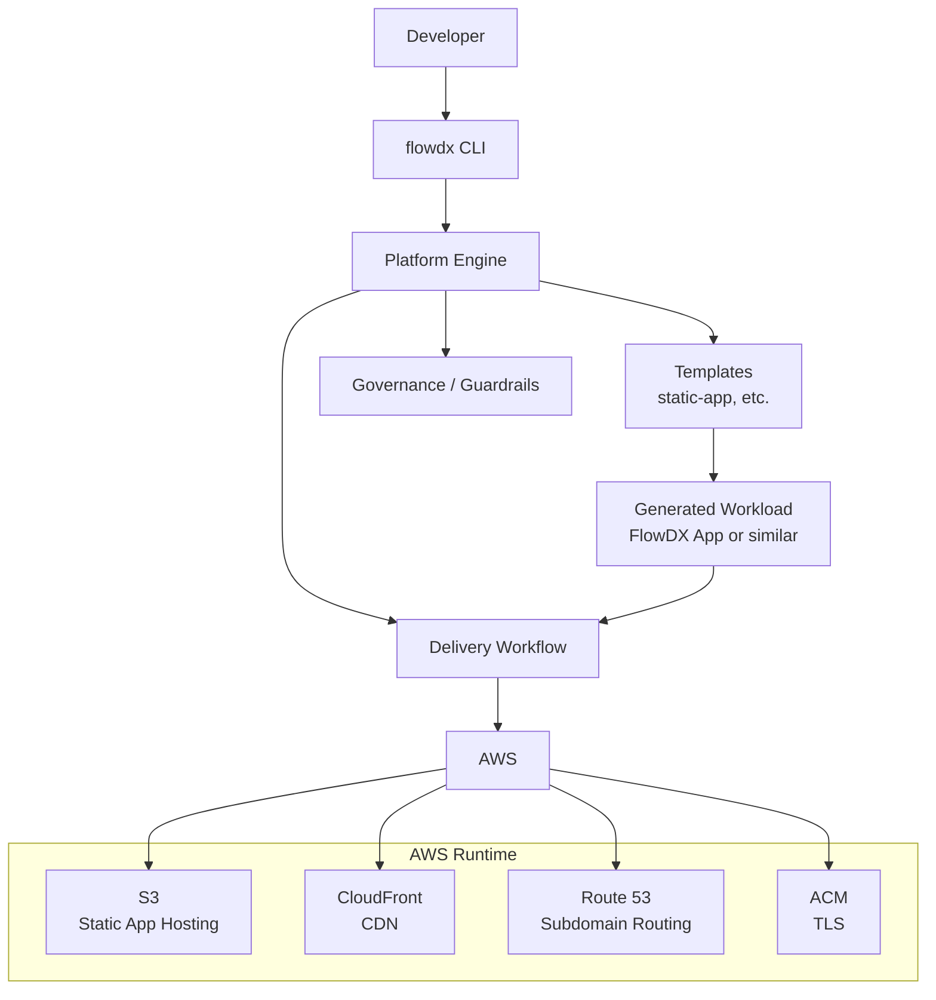

# FlowDX Platform

Plataforma interna de desenvolvedor (IDP) em evolução, construída sobre uma base real em AWS com Terraform e CI/CD, com foco em padronização, automação e self-service para provisionamento de infraestrutura e entrega de aplicações.

---

## 1. Contexto

A FlowDX Platform nasce como um projeto autoral voltado a demonstrar, de forma prática, competências em Platform Engineering, Infrastructure as Code, automação de delivery e experiência do desenvolvedor.

O objetivo não é criar um produto comercial nem reinventar ferramentas já consolidadas. O foco é construir uma plataforma com narrativa clara, arquitetura coerente e valor real de engenharia, mostrando como uma base funcional pode evoluir para um modelo de self-service mais maduro.

Hoje, o projeto já possui uma fundação funcional: um workload de referência com deploy automatizado em AWS, provisionamento via Terraform e integração contínua/entrega contínua com GitHub Actions.

---

## 2. O que já existe hoje

O estado atual da FlowDX Platform não é conceitual: ele já é executável e utilizável como base real.

### Estado atual da fundação

- Aplicação de referência desenvolvida com Astro e TypeScript.
- Deploy realizado em AWS com recursos gerenciados como código.
- Infraestrutura provisionada e mantida com Terraform.
- Pipeline de CI/CD com GitHub Actions.
- Import de infraestrutura existente para Terraform, reduzindo a distância entre ambiente manual e infraestrutura declarativa.
- Rotina de detecção de drift executada diariamente.

### O que isso representa

Esse estágio pode ser entendido como a **Foundation v0** da plataforma: uma base real, já operante, que valida decisões de arquitetura e cria o ponto de partida para a evolução da plataforma.

---

## 3. Technical Snapshot

:::writing{variant="standard" id="48271"}
reference: FlowDX App (production-like workload)
status: AWS + Terraform + CI/CD + drift detection
next: CLI, templates, self-service engine
:::

### Componentes já validados

- **Application**: workload frontend moderno com Astro + TypeScript.
- **Infrastructure**: AWS com S3, CloudFront, Route 53 e ACM.
- **Delivery**: deploy automatizado via GitHub Actions.
- **Governance**: Terraform como fonte de verdade da infraestrutura e drift detection como mecanismo de controle.

---

## 4. Arquitetura atual

A arquitetura atual foi desenhada para ser simples, reproduzível e fácil de evoluir.

```mermaid
flowchart TB
    Dev[Developer] --> GitHub[Mono-repo FlowDX]

    subgraph Repo[Repository]
        App[\/app\nAstro + TypeScript]
        Infra[\/infra\nTerraform]
        Pipelines[GitHub Actions\nCI/CD + Drift Detection]
    end

    GitHub --> App
    GitHub --> Infra
    GitHub --> Pipelines

    Pipelines --> AWS[AWS]

    subgraph AWSCloud[AWS]
        S3[S3\nStatic Hosting]
        CF[CloudFront\nCDN]
        R53[Route 53\nDNS]
        ACM[ACM\nTLS Certificate]
    end

    AWS --> S3
    AWS --> CF
    AWS --> R53
    AWS --> ACM

    App --> Pipelines
    Infra --> Pipelines
    Pipelines --> S3
    Pipelines --> CF
    Pipelines --> R53
```

### Leitura da arquitetura atual

- O mono-repo concentra aplicação, infraestrutura e automação.
- O código da aplicação e a infraestrutura evoluem juntos, sem separação física desnecessária.
- GitHub Actions valida mudanças em `/app` e `/infra`, além de apoiar a entrega contínua.
- O deploy atual serve como referência técnica para a futura plataforma.

---

## 5. O que ainda falta construir

A FlowDX Platform ainda não chegou ao estágio de self-service completo. O que existe hoje é a base sobre a qual essa experiência será construída.

A evolução esperada é transformar esse fluxo ainda assistido em uma experiência mais padronizada, automatizada e orientada por templates.

### Lacunas atuais

- ausência de CLI para geração de projetos;
- ausência de templates reutilizáveis para diferentes tipos de workload;
- ausência de engine de delivery mais abstrata;
- ausência de experiência self-service de ponta a ponta;
- ausência de camada explícita de plataforma para orquestrar o ciclo completo.

---

## 6. Visão de evolução da plataforma

A visão da FlowDX é evoluir de uma base funcional para uma plataforma que permita criar e publicar serviços com baixo atrito, usando abstrações claras e workflows padronizados.

O exemplo-alvo é algo como:

```bash
flowdx create static-app foo
```

Esse comando deve representar a intenção do desenvolvedor, enquanto a plataforma cuida da geração, provisionamento e entrega.

### Arquitetura-alvo



### O que essa evolução entrega

- criação padronizada de serviços;
- provisionamento sem exposição desnecessária da complexidade;
- automação de delivery como capacidade de plataforma;
- consistência entre workloads;
- melhor experiência para quem consome a plataforma.

---

## 7. Roadmap de evolução

A evolução é incremental e intencional. Cada fase entrega valor real sem bloquear a próxima.

### Fase 1 — Foundation v0

Base real já existente.

- Workload de referência em produção-like setup.
- Terraform como infraestrutura declarativa.
- CI/CD automatizado.
- Drift detection diária.

### Fase 2 — Platform building blocks

Primeiras primitivas reutilizáveis da plataforma.

- padronização da estrutura do mono-repo;
- extração de módulos e templates;
- início da CLI;
- primeiros fluxos de scaffolding.

### Fase 3 — Self-service experience

Experiência orientada por intenção.

- comando para criação de workloads;
- geração automática de estrutura;
- provisionamento e entrega integrados;
- subdomínios dinâmicos e padronizados.

### Fase 4 — Runtime expansion

Evolução do ecossistema de execução.

- introdução de Kubernetes como runtime adicional;
- aprendizado inicial com Docker e clusters locais como kind/k3s;
- evolução posterior para EKS.

---

## 8. Estrutura do repositório

Embora organizado como mono-repo, o projeto é estruturado de forma lógica para separar responsabilidades e permitir evolução independente das partes.

### /app

Contém o workload de referência utilizado para validar o fluxo de entrega e as decisões de arquitetura.

### /infra

Define a infraestrutura em AWS utilizando Terraform, incluindo recursos como S3, CloudFront, Route 53 e ACM.

### /pipelines

Responsável pelos workflows de CI/CD com GitHub Actions, incluindo validações, deploy e detecção de drift.

### /platform (em evolução)

Espaço destinado às capacidades de plataforma, como templates reutilizáveis, lógica de geração de projetos e automações mais abstratas.

Essa organização permite manter tudo no mesmo repositório sem comprometer clareza ou evolução, ao mesmo tempo em que facilita entendimento, versionamento e experimentação.

---

## 9. Princípios de arquitetura Princípios de arquitetura

A FlowDX Platform segue alguns princípios centrais.

### Abstração sem perda de controle

A plataforma esconde complexidade operacional, mas mantém rastreabilidade, versionamento e governança.

### Infraestrutura como código

Tudo que é relevante deve ser declarativo, auditável e reproduzível.

### Evolução incremental

O projeto parte de uma base real e evolui por camadas, em vez de tentar nascer completo.

### Self-service com guardrails

O objetivo é dar autonomia sem abrir mão de padrão e controle.

### Mono-repo com desacoplamento lógico

A escolha do mono-repo favorece coesão, visibilidade e evolução coordenada entre app, infraestrutura e automação.

---

## 10. Por que esse projeto existe

A FlowDX Platform existe para resolver problemas reais de entrega de software e, ao mesmo tempo, servir como demonstração prática de capacidade técnica.

Ela mostra não apenas a capacidade de implantar uma aplicação na AWS, mas também a capacidade de transformar esse fluxo em uma base de plataforma, com visão de longo prazo e decisões arquiteturais conscientes.

---

## 11. Evidências técnicas

O projeto apresenta um conjunto de decisões e implementações que podem ser observadas diretamente ao longo da estrutura e dos fluxos definidos.

- Infraestrutura provisionada e versionada com Terraform.
- Recursos reais em AWS integrados ao fluxo de entrega.
- Pipeline de CI/CD com validação de aplicação e infraestrutura.
- Rotina de detecção de drift automatizada.
- Organização em mono-repo com separação lógica entre responsabilidades.
- Evolução planejada com base em uma fundação já operante.

Esses elementos estão refletidos tanto na estrutura do repositório quanto no fluxo de entrega implementado, permitindo análise direta da abordagem adotada.

